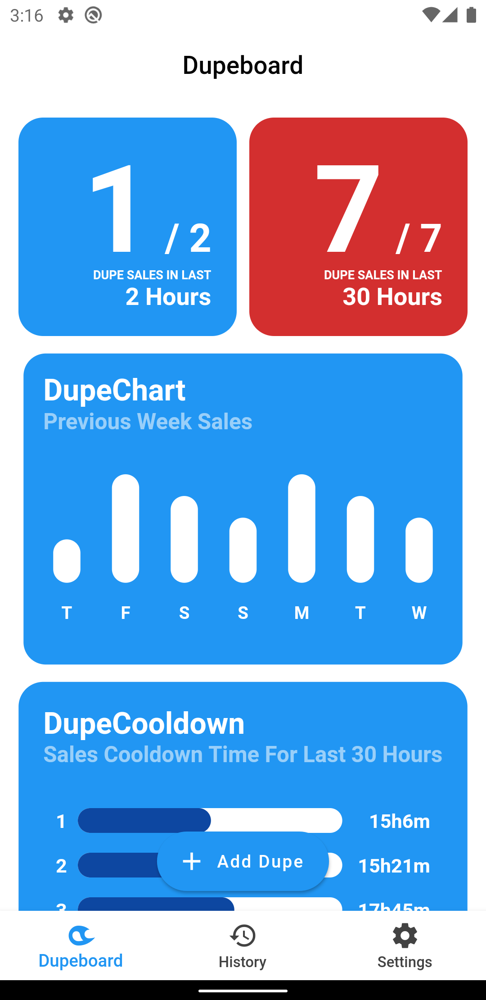
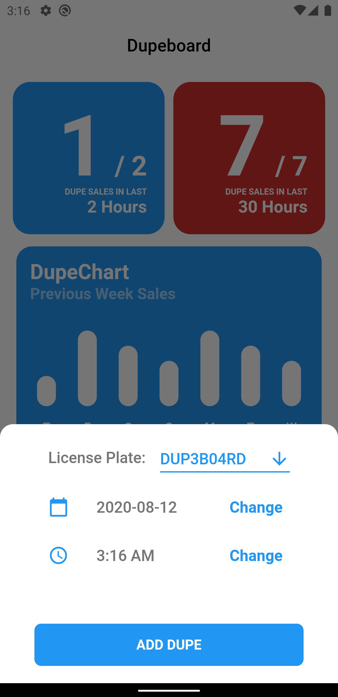
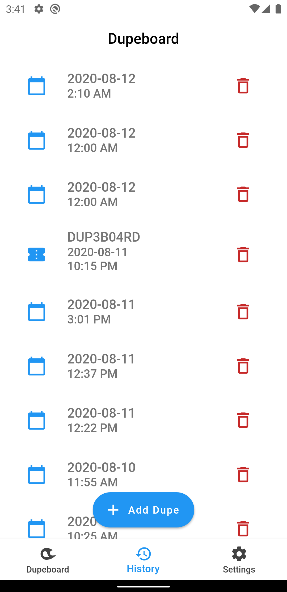
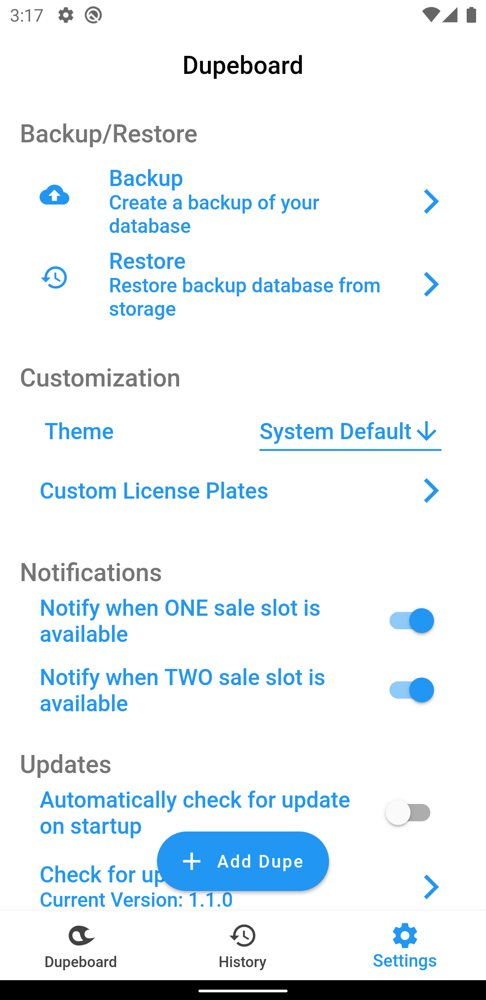
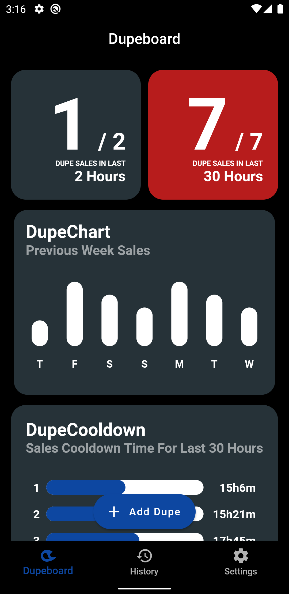
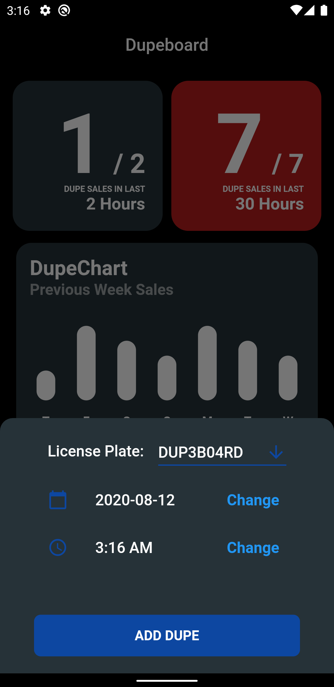
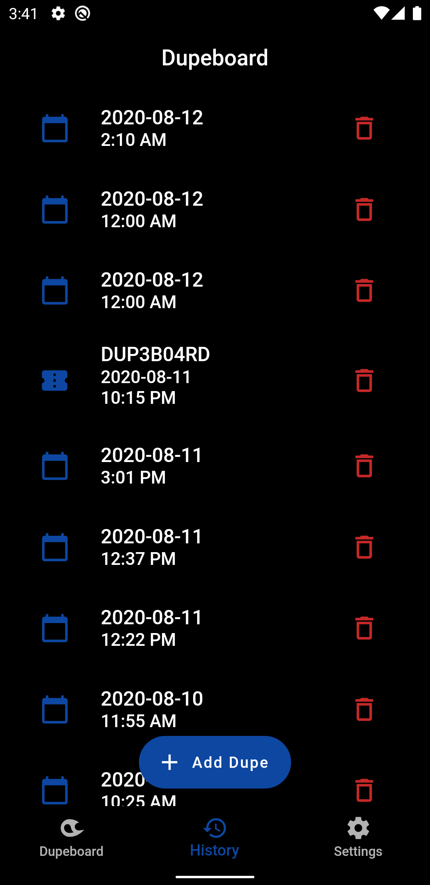
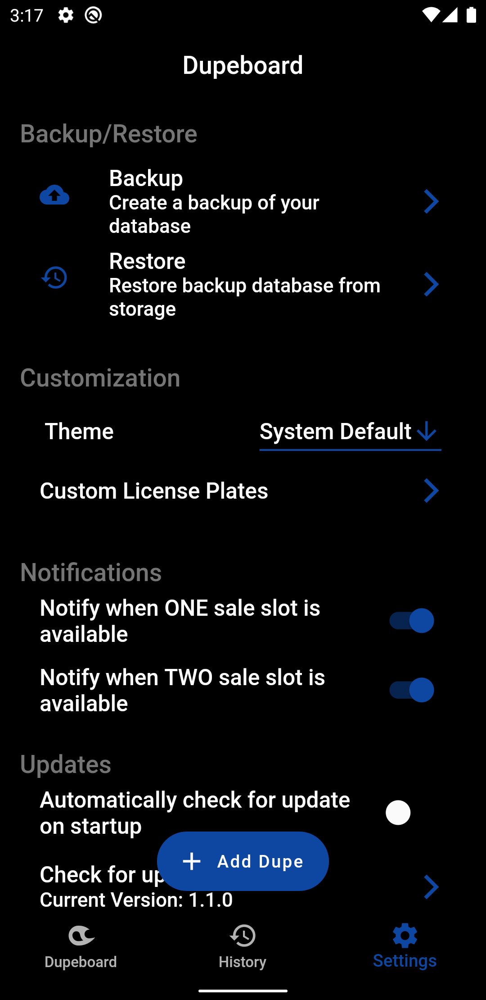

# Dupeboard v1.1.0

An android app to track GTA Online car sell limits. Helpful for those who are into vehicle duplicating glitches. 

This app is built with Flutter. If anyone want to build this app for iOS, you can start contributing.

Special thanks to this [r/gtaglitches](https://www.reddit.com/r/gtaglitches/comments/g3oabw/so_you_wanna_be_a_dupe_god/) thread.

## Minimum Requirement
- Android 5.0 Lollipop (API level 21)

## Releases
You can download the **Android App** for your device from **Releases** tab or by visiting [here](https://github.com/arnobk/dupeboard/releases). 

## Features
- Track car sell limits with custom license plates.
- Provides notifications when you are ready to sell one/two vehicle(s).
- Light and Dark Theme.
- Offline Database.
- Backup/Restore your database.
- Settings to toggle notifications.

## Screenshots
#### Light Theme

    
    
    
    

#### Dark Theme

    
    
    
    

## Issues/Feature Requests
If you find any bug then please create an issue. Same goes for feature requests. You can also send bug reports and feature request via in-app feedback section.

## Donation
If you like this project, you can support me on [Patreon](https://www.patreon.com/arnobk).

## Changelog
v1.1.0 (12 August 2020)
- Bug Fixes
    - Notification logic changed. Notification will now consider both limit.
    - Fixed UI bug on higher DPI.
    - Fixed Add Dupe bottom sheet border radius.
- Features Added
    - Dark Theme.
    - Custom License Plates on Dupes.
    - Pull to refresh on certain screen.
    - Automatic update check on launch (Toggle it on Settings).
    - Added FAQ Screen.
    - Added in-app feedback.

v1.0.0 (7 August 2020) ([r/gtaglitches](https://www.reddit.com/r/gtaglitches/comments/i5g1j1/an_android_app_for_tracking_gta_online_daily/))
- Initial Release
