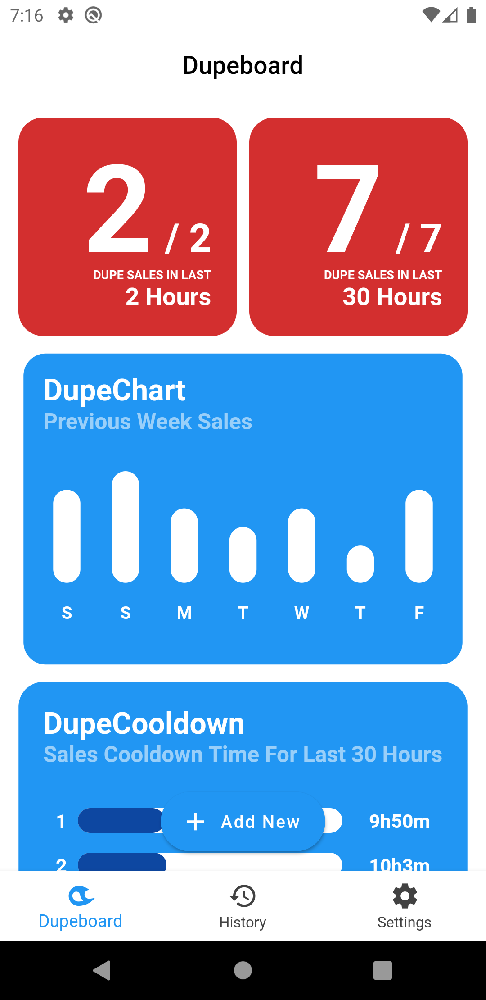
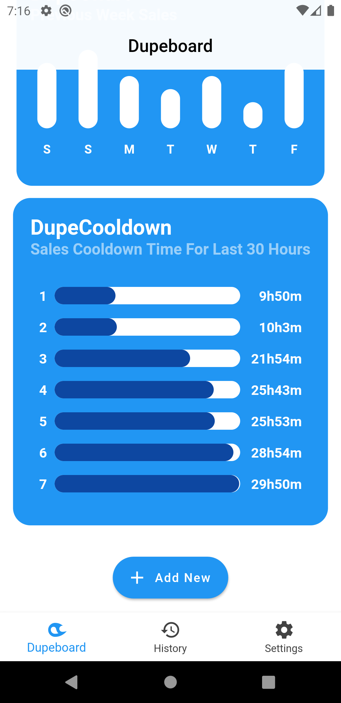
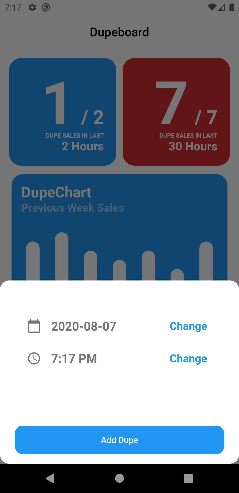
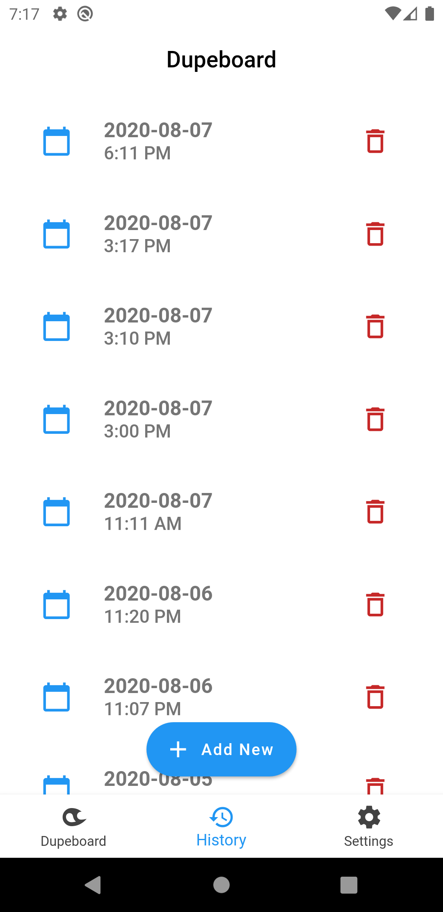
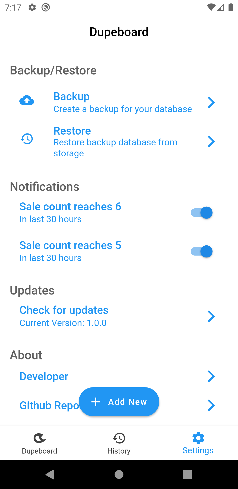

# Dupeboard

An android app to track GTA Online car sell limits. Helpful for those who are into glitch.

This app is built with Flutter. If anyone want to build this app for iOS, you can start contributing.

## Releases
You can download the **Android App** for your device from **Releases** tab or by visiting [here](https://github.com/igeniusarnob/dupeboard/releases). 

## Features
- Track car sell limits.
- Provides notifications.
- Offline Database.
- Backup/Restore your database.
- Setting to toggle notifications.

## Screenshots

    
    
    
    
    

## Issues/Feature Requests
If you find any bug then please create an issue. Same goes for feature requests.

## Changelog
v1.0.0
- Initial Release (7 August 2020)

